# Build Private Cloud Step by Step from the baremetal to container using Kubevirt and Kubernetes

I always believe the best way to understand sepcific technology, is to try to build myself, which give me on what will go well, and what will go bad, still building a compelete cloud is significate challenge 

## What we are going to Build 

* A platform to handle both VM, and Containers.
* Software Defined Networking and Software Defined Storage
* Provide a single Unified commandline to manage Network, Storage, Virtual Machines, and Containers.

## To raise the challenge even more 

* I am going to build on my 8GB Personal Laptop
* I do not have any previous knowledge to the common technology such as VMWARE, OpenStack or Apache Stack 
* Using only my Kubernetes Knowledge.
* I am going to put in Single Article 
* Using only Opensource documentation from the Project documentation with Zero Coding.
* Nothing Pre-installed  will start with Empty VM or Empty Machine

## *Sounds Impossible!!!!!*  will explain in the upcoming section, unless you know Kubevirt you can skip to steps


## If we can start by defining the cloud 

Cloud used be defined in very simple way as follow  XaaS, X as a Service'
* IaaS Infrastructure as a Sevice
* PaaS Platform as a Service
* SaaS Software as a Service

### Ingredient 
* Few Baremetal machines.
* Few Networking device.
* Few Flash Disk.
* Few Master Minds in netwokring, storage and virtualization to assemble all of that together.

Lot of product the exists as commercial and Opensource to provide this capabilites such OpenStack, ApacheStack, vSphere, ... etc

So it is a matter of installing those tool and configuring it right ... !!! 
Unfortunatly those tools is either commercially very expensive, or come with its own challenge and learning curves and their own definition.

## What it take to build a modern Private Cloud?

One word the SDX family with the Rise of Cloud native more and more SDX come to play but what is SDX it Software Defined X
The most comonly known components are 
* SDN : Software Defined Networking
* SDS : Software Defined Storage

### SDN Software Defined Network
Controlling the traffic between your Virtual machines, is no longer configuration in your physical switch or router, with SDN we build some sort of Overlay accross all your physical host, and start rebuild the whole network and security policies around it.

### SDS Software Defined Storage
Providing a shared storage pool, is by bringing up All Flash appliance, or spinning Desks, Or SDS way of doing things is just bring Some machines and install SDS on top of them, so you will your Storage As A Service ready to serve ;).


## Kubernetes is more than just Container Orchestrator 

Kubernetes is the most used platform for container orchestration, a closer look at Kubernetes reveal that is is more than Just Container Orchestrator, as It provides the CXI where X is N or S 
* CNI : Container Network Interface 
* CSI : Container Storage Interface

### CNI and CSI in Kuberntes 
Which is an standard specs and libraries to be adopted by the industry and community to integrate Kubernetes with SDN such as NSX-T, Cisco ACI, Calico, .... .
Also CSI which give provide a standarized interface for Storage as well as Software Defined Storage.

### Custom Resource Definition
In Addition to standard Object, Kubernetes provide a good expandability with the custom resource definition make you able to create your own Resources the concepts extended by later with adopting the Operator Patterns.

### Building a Private cloud that handle Both Virtual Machines and Containers

Kubernetes to be installed on top Baremetal machine, or Virtual Machine, on top of Hypervisor 
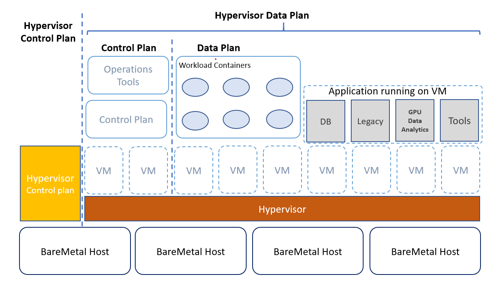

#### Advantage of this approach

The products that implement this design is mature as Opensource, or as commercial.

#### Disadvantage 

IT IS COMPLEX !!!!!!!!!!!!
two different products , differnt types of APIs, different dahsboard
Different Highly tained skilled engineer.
Compatibility needs to insure between all different components
Two types of Control plan, that consume additional resources.


### Kubevirt when Kubernetes meets LibVirt.
Let us put everything together, CNI, CSI , CRD, which can be used to define and create a compelete Virtual Machine not only Containers, or customized light weight VM, It is full VM and can be created, managed by Kubernetes as well as all Networking, Storage, provided by the Kubernetes API.

With that we have a compelete Solution that will provide the following IaaS (Virtual Machine, Storage, Networking), PaaS (Kubernetes Operators)

A single Unified API to manage the enviroments, Additionally the core functionalities Kubernetes itself of managing Containers, which will become more attactive when it managing the networking between containers and VM by the standard Kubernetes configurations.

Reimagining The Architecure with Kubevirt and Kubernetes only 


#### Advantage of this approach
Simpler at least on the digram
Single control plan
Mainly Kubernetes Skills is required

#### Disadvantage 
Still new technology as opensource
Commercial support  by Redhat CNV still in [Tech preview as per the time of writing this article](https://www.redhat.com/en/resources/container-native-virtualization)
UI and Dahsboard not available again, Redhat CNV will introduce it.

## Without Further Ado let's build a Private Cloud based Kuebrnetes

Ingredients: 
* 8 GB laptop Windows, Mac or Linux
* Home Switch any brand
* Hypervisor layer unless you want to run natively in your machine (I am using Windows Hyper-v)

## Step 1: Create the VM or If you additional machine skip this. 

I am using Hyper-V, and connecting my connection to host network directly
Machine Specs I used 
4 Cores
4 GB RAM

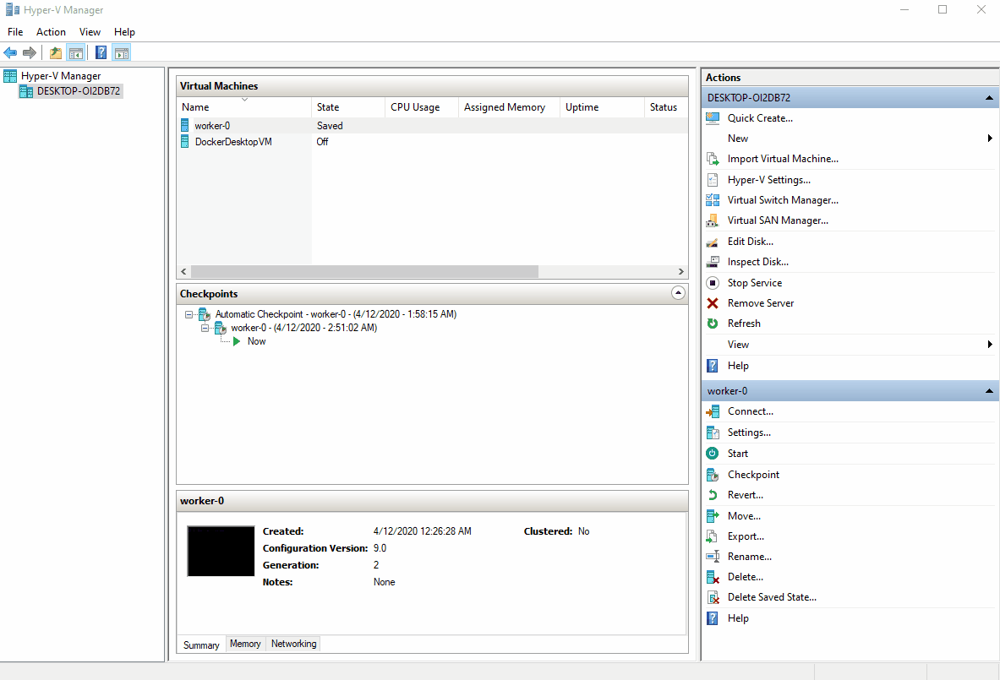

## Step 2: Mount the Host OS iso, I am using Ubuntu 8.10

In Hyper-V  disable secure boot, in order to be to install Linux


## Step 3: Install the Operating System

Few steps nothing special just follow the default settings all configuration will be done as post installation, the key aspect is to insure that your IP address is taken from your home swith by configuring the maching as host network.

The installer will prompt to restart the machine


## Step 4: Install Docker 

4.A : Open the machine from the console to get the ip as well as ping any public web site to insure there public internet connectivity

4.B : At this step no longer need to access the machine directly, you can just ssh it, I started it in headless mode, do the usual apt update and install docker 
Or just curl this ready made script
```
curl https://raw.githubusercontent.com/ahmadsayed/useful-tools/master/install-docker-ubuntu-1804.sh |  sh - 
```
to check if installation is successful 
```
sudo docker run hello-world
```


## Step 5: Install Kubernetes 
Yes, we will use the kubeadm provided from kubernetes documentation (https://kubernetes.io/docs/setup/production-environment/tools/kubeadm/install-kubeadm/)

5.A Install required Tools and Post configure the OS

Letting iptables see bridged traffic

```
cat <<EOF > /etc/sysctl.d/k8s.conf
net.bridge.bridge-nf-call-ip6tables = 1
net.bridge.bridge-nf-call-iptables = 1
EOF
sysctl --system
```
Installing kubeadm, kubelet and kubectl
```
sudo apt-get update && sudo apt-get install -y apt-transport-https curl
curl -s https://packages.cloud.google.com/apt/doc/apt-key.gpg | sudo apt-key add -
cat <<EOF | sudo tee /etc/apt/sources.list.d/kubernetes.list
deb https://apt.kubernetes.io/ kubernetes-xenial main
EOF
sudo apt-get update
sudo apt-get install -y kubelet kubeadm kubectl
sudo apt-mark hold kubelet kubeadm kubectl
```

Turning off swap this configuration is not persistent.
```
sudo swapoff -a
```
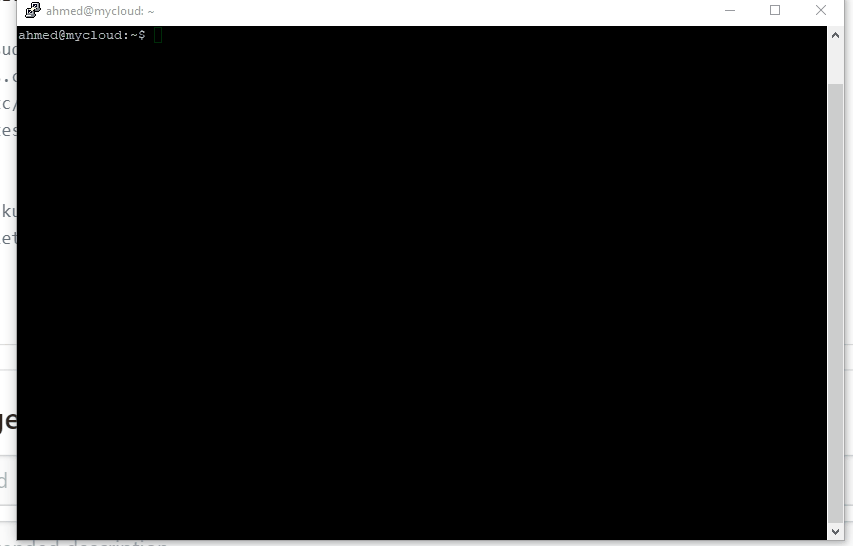

5.B Install Kubernetes 

```
sudo kubeadm init --pod-network-cidr=192.168.0.0/16
```

If you notice the node will remain Not Ready because we need to install Calico, Kubernets by default does not have capability to assign IP to the pods for example


5.c Install Deploy Calico

No more need for sudo :), we already admin now on kubernetes itself.
```
kubectl apply -f https://docs.projectcalico.org/v3.11/manifests/calico.yaml
## In my case I have single machine, so I will make master schedulable by removing the master label
kubectl taint nodes --all node-role.kubernetes.io/master-
```
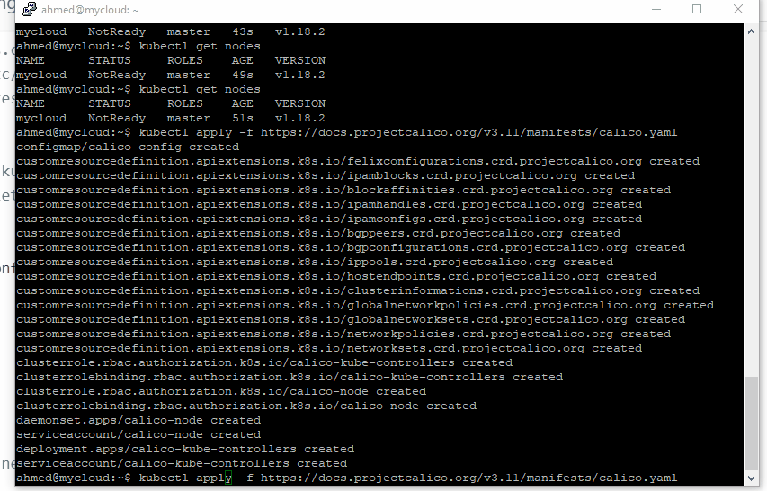
6. Configure Dynamically provision Software Defined Block Storage

For storage we have many options, which requie quiet resources, in our cloud we will pick only block storage, by using Rancher Project Longhorn as it is the easiest to install.

Longhorn can be installed as helm or using kubectl only, following our minimalistic approach we are going to use kubectl only

```
kubectl apply -f https://raw.githubusercontent.com/longhorn/longhorn/master/deploy/longhorn.yaml
kubectl edit svc longhorn-frontend -n longhorn-system
```


change ClusterIP to NodePort and open longhorn front end dashboard 


## Install KubeVirt.

As of now we built a functional Kubernetes Cluster with only opensource technologies, time to give it capabilities to provision a virtual machine


### Step 7: Install libvirt on the all host machines, in my case one machine

```
sudo apt install libvirt-clients
virt-host-validate qemu
```
expected response in case running on VM, all PASS in case you are running on your machine directly
```
ahmed@mycloud:~$ virt-host-validate qemu
  QEMU: Checking for hardware virtualization                                 : FAIL (Only emulated CPUs are available, performance will be significantly limited)
  QEMU: Checking if device /dev/vhost-net exists                             : PASS
  QEMU: Checking if device /dev/net/tun exists                               : PASS
  QEMU: Checking for cgroup 'memory' controller support                      : PASS
  QEMU: Checking for cgroup 'memory' controller mount-point                  : PASS
  QEMU: Checking for cgroup 'cpu' controller support                         : PASS
  QEMU: Checking for cgroup 'cpu' controller mount-point                     : PASS
  QEMU: Checking for cgroup 'cpuacct' controller support                     : PASS
  QEMU: Checking for cgroup 'cpuacct' controller mount-point                 : PASS
  QEMU: Checking for cgroup 'cpuset' controller support                      : PASS
  QEMU: Checking for cgroup 'cpuset' controller mount-point                  : PASS
  QEMU: Checking for cgroup 'devices' controller support                     : PASS
  QEMU: Checking for cgroup 'devices' controller mount-point                 : PASS
  QEMU: Checking for cgroup 'blkio' controller support                       : PASS
  QEMU: Checking for cgroup 'blkio' controller mount-point                   : PASS
WARN (Unknown if this platform has IOMMU support)
```
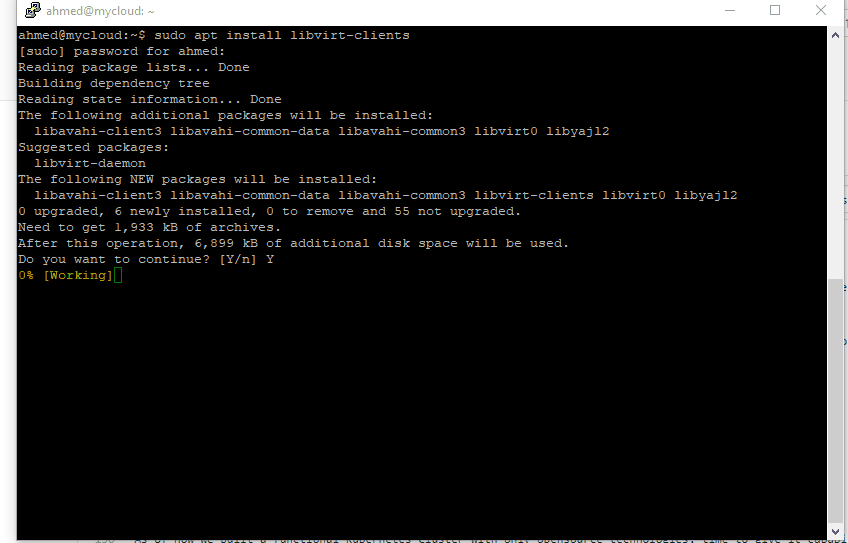


Create kubevirt namespace

```
kubectl create namespace kubevirt
```

in case you are using Virtual Machine as Host, you need to apply this configuration 

```
kubectl create configmap -n kubevirt kubevirt-config \
    --from-literal debug.useEmulation=true
```

### Step8: Installing kubevirt

```
export VERSION=v0.27.0
kubectl apply -f https://github.com/kubevirt/kubevirt/releases/download/${VERSION}/kubevirt-operator.yaml
kubectl apply -f https://github.com/kubevirt/kubevirt/releases/download/${VERSION}/kubevirt-cr.yaml
kubectl -n kubevirt wait kv kubevirt --for condition=Available
```

if last statement  give timeout ignore it use the following command to monitor kubevirt installation
```
kubectl get po -n kubevirt
```

At this stage we have kubevirt ready to serve, detailed installation guide found in here 
https://kubevirt.io/user-guide/#/installation/installation

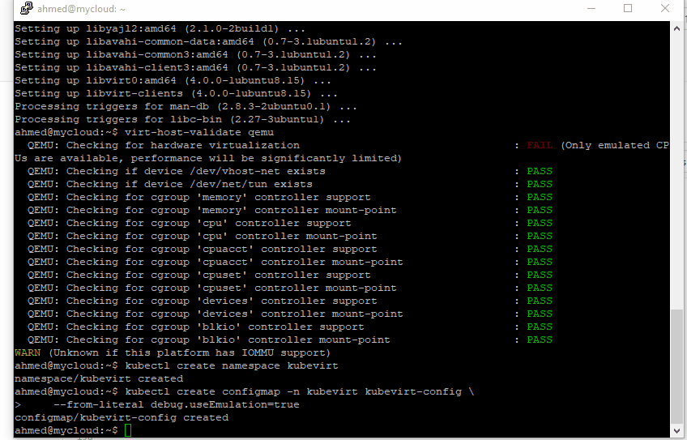

### Step 9: Install virt client tool

To manage our minimalist cloud we need a single command line like ibmcloud in case of IBM, az in case Azure, aws in case of Amazong, in our case our global command is not surprise kubectl

we will use kubectl to create vm , container, setup the network, create the storage.

but additional extention needed 

```
export VERSION=v0.27.0
wget https://github.com/kubevirt/kubevirt/releases/download/${VERSION}/virtctl-${VERSION}-linux-x86_64
```
install krew kubectl plugin manager
```
(
  set -x; cd "$(mktemp -d)" &&
  curl -fsSLO "https://github.com/kubernetes-sigs/krew/releases/latest/download/krew.{tar.gz,yaml}" &&
  tar zxvf krew.tar.gz &&
  KREW=./krew-"$(uname | tr '[:upper:]' '[:lower:]')_amd64" &&
  "$KREW" install --manifest=krew.yaml --archive=krew.tar.gz &&
  "$KREW" update
)
```

finally install virtctl plugin 

```
export PATH="${PATH}:${HOME}/.krew/bin"
kubectl krew install virt
```

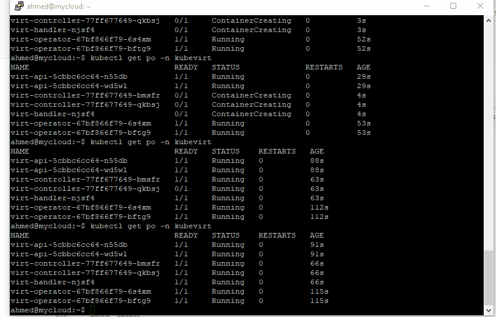

## Creating the first Virtual machine 

Time to create a virtual machine, and we will not get simple OS such busybox, or cirros, we will a real fedora instant 

```
nano testvm.yaml
```
Past the following Contents

```
apiVersion: kubevirt.io/v1alpha3
kind: VirtualMachineInstance
metadata:
  name: testvmi-nocloud
spec:
  terminationGracePeriodSeconds: 30
  domain:
    resources:
      requests:
        memory: 1024M
    devices:
      disks:
      - name: containerdisk
        disk:
          bus: virtio
      - name: emptydisk
        disk:
          bus: virtio
      - disk:
          bus: virtio
        name: cloudinitdisk
  volumes:
  - name: containerdisk
    containerDisk:
      image: kubevirt/fedora-cloud-container-disk-demo:latest
  - name: emptydisk
    emptyDisk:
      capacity: "2Gi"
  - name: cloudinitdisk
    cloudInitNoCloud:
      userData: |-
        #cloud-config
        password: fedora
        chpasswd: { expire: False }
```        


To Access the VM try 

```
kubectl virt console  testvmi-nocloud
```
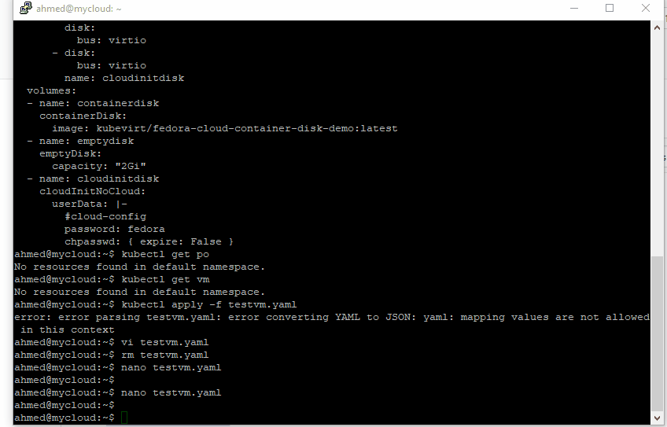
## Networking Time 

### Step 11: Accessing the Internet

login the machine via fedora/fedora 

try to access internet e.g.

```
curl https://www.google.com
```

if you recieved it depends on the enviroment, this may  happens in case of you are using Winodws and Hyper-v, I do not think if you run on baremetal you will face the same issue

```
[fedora@testvmi-nocloud ~]$ curl https://www.google.com
curl: (6) Could not resolve host: www.google.com
```
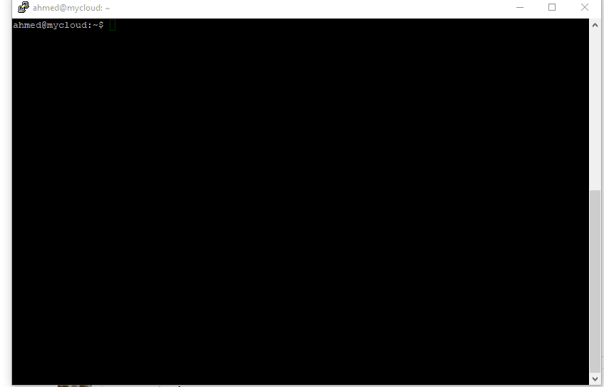

it means the DNS is not configured properly but how we can fix it ??!!!

Looks no far it is all Kubernetes check your coredns configure

```
kubectl edit cm  coredns -n kube-system
```

if you recieved something like that 

```
  Corefile: |
    .:53 {
        errors
        health {
           lameduck 5s
        }
        ready
        kubernetes cluster.local in-addr.arpa ip6.arpa {
           pods insecure
           fallthrough in-addr.arpa ip6.arpa
           ttl 30
        }
        prometheus :9153
        forward . /etc/resolv.conf
        cache 30
        loop
        reload
        loadbalance
    }

```

The problem in this line 

```
        forward . /etc/resolv.conf

```
replace it with 
```
        forward . 8.8.8.8
```        
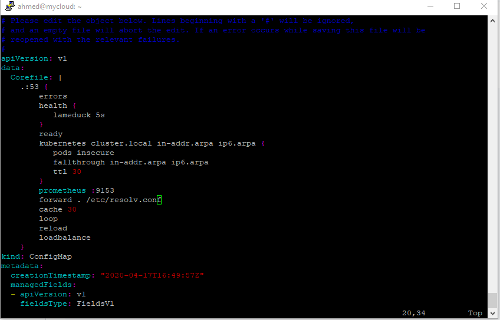

Explanation: 
In Cloud native world we need Service Discovery, kubernetes used to implement it via DNS using coredns, which as it sounds a dns
the corefile, is configuration which tell kubernetes for none cluster.local fall back to the host dns which is configured in /etc/resolve.conf

For the sake of simplicity we will replace it with the legendary 8.8.8.8

Now Delete the vm and recreate it 

```
kubectl delete -f testvm.yaml
kubectl create -f testvm.yaml
```

Try to access Google again 

```
curl https://www.google.com
```


### Step 13: VM to Pod Communication


Access the machine via ssh from another pod 

Install Pod in order to test the connectivity 

```
kubectl apply -f https://raw.githubusercontent.com/istio/istio/release-1.5/samples/sleep/sleep.yaml
```


pod can simply access the vm via its cluster IP

```
kubectl get vmi #get the Cluster IP of the Virtual Machine
kubectl get po 
kubectl exec -ti sleep-8f795f47d-zj7bx -- sh #Replace it with your Pod name
ping 192.168.188.34
```


### Step 14 : Add the VM to service discover a.k.a kubernetes DNS coredns, the sameway we define service to kubenetes we need to modify the VM yaml file as well as create a service

```
apiVersion: kubevirt.io/v1alpha3
kind: VirtualMachineInstance
metadata:
  name: testvmi-nocloud
  labels:
    vm: fedora  
spec:
  terminationGracePeriodSeconds: 30
  domain:
    resources:
      requests:
        memory: 1024M
    devices:
      disks:
      - name: containerdisk
        disk:
          bus: virtio
      - name: emptydisk
        disk:
          bus: virtio
      - disk:
          bus: virtio
        name: cloudinitdisk
  volumes:
  - name: containerdisk
    containerDisk:
      image: kubevirt/fedora-cloud-container-disk-demo:latest
  - name: emptydisk
    emptyDisk:
      capacity: "2Gi"
  - name: cloudinitdisk
    cloudInitNoCloud:
      userData: |-
        #cloud-config
        password: fedora
        chpasswd: { expire: False }
```

Then add  Service
```
apiVersion: v1
kind: Service
metadata:
  name: vmservice
spec:
  selector:
    vm: fedora
  clusterIP: None
  ports:
  - name: port-22 # this is just dns entry  no port needed as per documentation 
    port: 22
    targetPort: 22
```


Try to run the ping within sleep pod 

```
kubectl get po 
kubectl exec -ti sleep-8f795f47d-zj7bx -- sh
ping vmservices
```
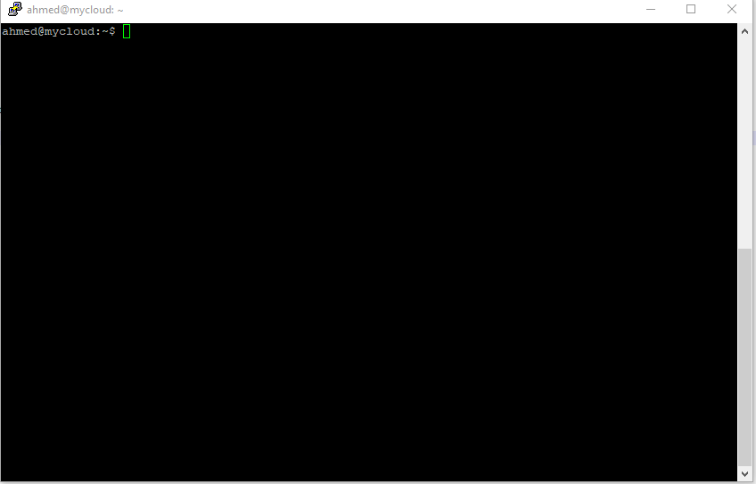

Notice the IP it is the same IP of the VM Machine, We successfully created the DNS for this VM using Kubernetes Service.

## The Storage 

### Step 16: Empty disk the ephemeral storage.
How the storage will be handled recall the longhorn storage solution the current specification uses empty dir as second storage

```
  - name: emptydisk
    emptyDisk:
      capacity: "2Gi"
```

So there is 2 Gi Disk Mounted let us explore it via accessing the machine directly

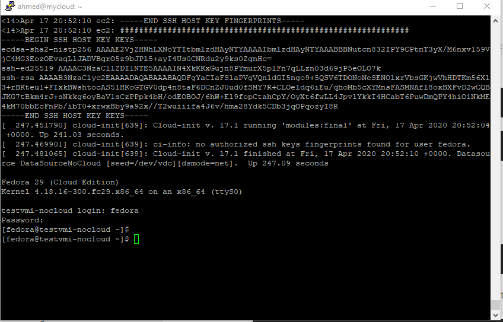

The Previous Demo show creating a disk and add file on it, but this ephemeral device if you delete this VM the disk will be raw again and need to be recreated 
Instead of using emtpy dir we will longhorn as our persistent volume by modifying the machine specs one more time 

### Step 17: Using shared storage provided by SDS instead of empty dir container storage.

First Create Persistence Volume 

```
apiVersion: v1
kind: PersistentVolumeClaim
metadata:
  name: longhornpvc
spec:
  accessModes:
    - ReadWriteOnce
  resources:
    requests:
      storage: 8Gi
  storageClassName: longhorn
```

The delete the vm and recreate it with the below configuration 

```
kubectl delete -f testvm.yaml
kubectl create -f testvm.yaml
```

```
apiVersion: kubevirt.io/v1alpha3
kind: VirtualMachineInstance
metadata:
  name: testvmi-nocloud
spec:
  terminationGracePeriodSeconds: 30
  domain:
    resources:
      requests:
        memory: 1024M
    devices:
      disks:
      - name: containerdisk
        disk:
          bus: virtio
      - name: blockdisk
        disk:
          bus: virtio
      - disk:
          bus: virtio
        name: cloudinitdisk
  volumes:
  - name: containerdisk
    containerDisk:
      image: kubevirt/fedora-cloud-container-disk-demo:latest
  - name: blockdisk
    persistentVolumeClaim:
        claimName: longhornpvc
  - name: cloudinitdisk
    cloudInitNoCloud:
      userData: |-
        #cloud-config
        password: fedora
        chpasswd: { expire: False }
```


Now time to boot the machine check the disk with lsblk 


```
-bash-4.4$ lsblk
NAME   MAJ:MIN RM  SIZE RO TYPE MOUNTPOINT
vda    252:0    0    4G  0 disk
└─vda1 252:1    0    4G  0 part /
vdb    252:16   0  7.8G  0 disk
vdc    252:32   0  366K  0 disk
```

Now create ext4 file system, and mount it 

```
sudo mkfs.ext4 /dev/vdb
sudo mkdir /mnt/disk1
sudo mount /dev/vdb /mnt/disk1
```

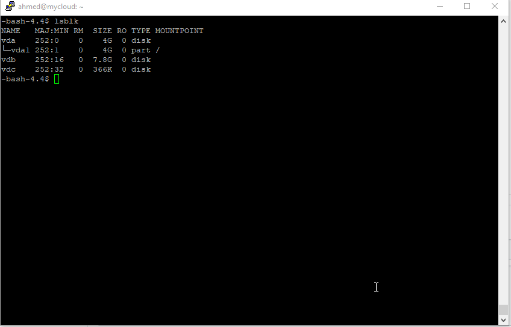

## Final words

When Kubevirt introduced it was a reimagintion for the hypervisor, Kubernetes is more than just a container platform, it is very extendable, kubevirt define all resources as yaml so by core it is Infrastructure as Code.
So Kubernetes may no longer be a platform on top hypervisor, it may be the hypervisor itself alongside the container orchestrator, which levetate to be a compelete cloud orchestration layer.
